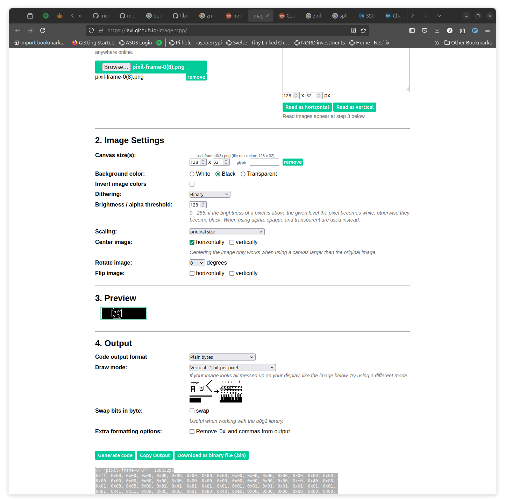

+++
title = "Custom OLED logo with QMK firmware"
date = 2024-11-18
description = "simple guide for OLED logo customization"
draft = false

[taxonomies]
tags = ["keyboard"]
categories = ["General"]

[extra]
lang = "en"
toc = true
+++
You need only a few steps to create a custom logo for your OLED screen. I have a `0.91 OLED LCD Display 128x32 SSD1306 I2C`, but you can follow this guide for other resolutions/sizes as well.

1. Create your art:
  - size should be 128 × 32 pixels
  - `.PNG`
  - use black or white background color

2. convert your png to bitmap
  - [https://javl.github.io/image2cpp/](https://javl.github.io/image2cpp/)



3. click generate
4. copy the code to your keymap.c like this:
```c
void oled_render_logo(void) {
    static const char PROGMEM crkbd_logo[] = {
    0x00, 0x00, 0x00, 0x00, 0x00, 0x00, 0x00, 0x00, 0x00, 0x00, 0x00, 0x00, 0x00, 0x00, 0x00, 0x00,
    0x00, 0x00, 0x00, 0x00, 0x00, 0x00, 0x00, 0x00, 0x00, 0x00, 0x00, 0x00, 0x00, 0x00, 0x00, 0x00,
    0x00, 0x00, 0x00, 0x00, 0xf0, 0xfc, 0xfc, 0xcc, 0xcc, 0xcc, 0x1c, 0xfc, 0xfc, 0x30, 0x30, 0x30,
    0x30, 0x3c, 0xfc, 0x1c, 0xcc, 0xcc, 0xfc, 0xfc, 0xf0, 0x00, 0x00, 0x00, 0x00, 0x00, 0x00, 0x00,
    0x00, 0x00, 0x80, 0xc0, 0xe0, 0x70, 0x70, 0x70, 0xe0, 0xc0, 0xc0, 0xe0, 0x70, 0x70, 0x70, 0xe0,
    0xc0, 0x80, 0x00, 0x00, 0x00, 0x00, 0x00, 0x00, 0xe0, 0xf8, 0xf8, 0x98, 0x98, 0x38, 0xf8, 0x78,
    0x60, 0x60, 0x60, 0x60, 0xf8, 0xf8, 0x38, 0x98, 0x98, 0x98, 0xf8, 0xf8, 0xe0, 0x00, 0x00, 0x00,
    0x00, 0x00, 0x00, 0x00, 0x00, 0x00, 0x00, 0x00, 0x00, 0x00, 0x00, 0x00, 0x00, 0x00, 0x00, 0x00,
    0x00, 0x00, 0x00, 0x00, 0x00, 0x00, 0x00, 0x00, 0x00, 0x00, 0x00, 0x00, 0x00, 0x00, 0x00, 0x00,
    0x00, 0x00, 0x00, 0x00, 0x00, 0x00, 0x00, 0x00, 0x00, 0x00, 0x00, 0x00, 0x00, 0x00, 0x80, 0x80,
    0xf8, 0xfc, 0x1c, 0x1f, 0x07, 0x07, 0x07, 0x05, 0x05, 0xc5, 0xc7, 0xc7, 0xcf, 0xcc, 0xcc, 0xc0,
    0xcc, 0xcc, 0xc3, 0xc7, 0xc5, 0xc5, 0x1f, 0x1f, 0x3d, 0xf8, 0xe0, 0x00, 0x00, 0x00, 0x00, 0x00,
    0x00, 0x1f, 0x3f, 0x7f, 0xe0, 0xc0, 0x80, 0x00, 0x00, 0x01, 0x01, 0x00, 0x00, 0x80, 0xc0, 0xe0,
    0x7f, 0x3f, 0x1f, 0x00, 0x00, 0x00, 0xc0, 0xf0, 0x7b, 0x3f, 0x3f, 0x8b, 0x8b, 0x8e, 0x87, 0x98,
    0x98, 0x80, 0x98, 0x98, 0x9f, 0x8f, 0x8e, 0x8b, 0x0b, 0x0b, 0x0f, 0x0f, 0x0f, 0x3e, 0x38, 0xf8,
    0xf0, 0x00, 0x00, 0x00, 0x00, 0x00, 0x00, 0x00, 0x00, 0x00, 0x00, 0x00, 0x00, 0x00, 0x00, 0x00,
    0x00, 0x00, 0x00, 0x00, 0x00, 0x00, 0x00, 0x00, 0x00, 0x00, 0x00, 0x00, 0x00, 0x00, 0x00, 0x00,
    0x00, 0x00, 0x00, 0x00, 0x00, 0x00, 0x00, 0x00, 0x00, 0x00, 0x00, 0xfc, 0xfe, 0xff, 0x87, 0xff,
    0xff, 0x80, 0x00, 0x00, 0x00, 0x38, 0xf8, 0xf8, 0xe0, 0xc0, 0x81, 0x81, 0x01, 0x01, 0x01, 0x01,
    0x01, 0x01, 0x01, 0x81, 0xc1, 0xe0, 0xfe, 0x3f, 0x3f, 0x0f, 0xff, 0xf8, 0xf8, 0x00, 0x00, 0x00,
    0x00, 0x00, 0x00, 0x00, 0x00, 0x01, 0x03, 0x07, 0x0e, 0x1c, 0x1c, 0x0e, 0x07, 0x03, 0x01, 0x00,
    0x00, 0x00, 0x00, 0x00, 0xf0, 0xf0, 0xff, 0x1f, 0x7e, 0x7e, 0xfc, 0xc1, 0x83, 0x03, 0x03, 0x03,
    0x03, 0x03, 0x03, 0x03, 0x03, 0x03, 0x03, 0x81, 0xc0, 0xf0, 0xf0, 0x70, 0x00, 0x00, 0x00, 0x01,
    0xff, 0xff, 0x0f, 0xfe, 0xfc, 0xf8, 0x00, 0x00, 0x00, 0x00, 0x00, 0x00, 0x00, 0x00, 0x00, 0x00,
    0x00, 0x00, 0x00, 0x00, 0x00, 0x00, 0x00, 0x00, 0x00, 0x00, 0x00, 0x00, 0x00, 0x00, 0x00, 0x00,
    0x00, 0x00, 0x00, 0x00, 0x00, 0x00, 0x00, 0x00, 0x00, 0x00, 0x00, 0x00, 0x00, 0x0f, 0x0f, 0x00,
    0x03, 0x0f, 0x0e, 0x0e, 0x0e, 0x0e, 0x01, 0x07, 0x0f, 0x0f, 0x03, 0x0f, 0x0e, 0x0e, 0x0e, 0x0e,
    0x0e, 0x0e, 0x0e, 0x0f, 0x0f, 0x0f, 0x0f, 0x0e, 0x0e, 0x0e, 0x0f, 0x03, 0x03, 0x00, 0x00, 0x00,
    0x00, 0x00, 0x00, 0x00, 0x00, 0x00, 0x00, 0x00, 0x00, 0x00, 0x00, 0x00, 0x00, 0x00, 0x00, 0x00,
    0x00, 0x00, 0x00, 0x00, 0x07, 0x07, 0x1f, 0x1c, 0x1c, 0x1c, 0x1f, 0x1f, 0x1f, 0x1f, 0x1c, 0x1c,
    0x1c, 0x1c, 0x1c, 0x1c, 0x1c, 0x1f, 0x07, 0x1f, 0x1f, 0x0f, 0x03, 0x1c, 0x1c, 0x1c, 0x1c, 0x1f,
    0x07, 0x01, 0x1f, 0x1f, 0x01, 0x01, 0x00, 0x00, 0x00, 0x00, 0x00, 0x00, 0x00, 0x00, 0x00, 0x00
    };
    oled_write_raw_P(crkbd_logo, sizeof(crkbd_logo));
}


```

5. call the previous function in `oled_task_user`:
```c
bool oled_task_user(void) {
    oled_render_logo();
}
```
