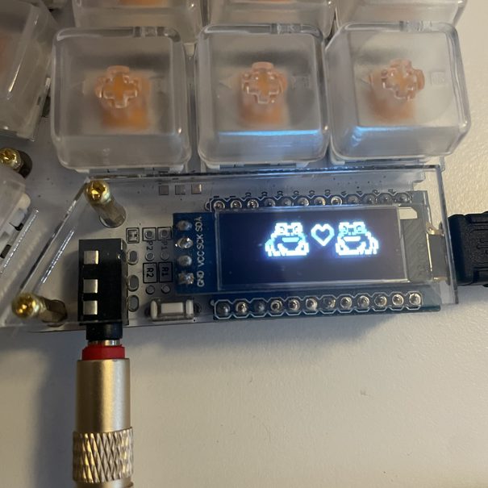

+++
title = "Custom OLED logo with QMK firmware"
date = 2024-11-18
description = "simple guide for OLED logo customization"
draft = false

[taxonomies]
tags = ["keyboard", "c"]
categories = ["General"]

[extra]
lang = "en"
toc = true
+++
If you are using [QMK firmware](https://github.com/qmk/qmk_firmware), you need only a few steps to create a custom logo for your OLED screen. I have a `0.91 OLED LCD Display 128x32 SSD1306 I2C`, but you can follow this guide for other resolutions/sizes as well.

1. Create your art:
  - size should be 128 × 32 pixels
  - `.PNG`
  - use black or white background color

2. convert your png to bitmap
  - [https://javl.github.io/image2cpp/](https://javl.github.io/image2cpp/)


3. click generate
4. copy the code to your keymap.c like this:
```c
void oled_render_logo(void) {
    static const char PROGMEM crkbd_logo[] = {
    0x00, 0x00, 0x00, 0x00, 0x00, 0x00, 0x00, 0x00, 0x00, 0x00, 0x00, 0x00, 0x00, 0x00, 0x00, 0x00, 
    0x00, 0x00, 0x00, 0x00, 0x00, 0x00, 0x00, 0x00, 0x00, 0x00, 0x00, 0x00, 0x00, 0x00, 0x00, 0x00, 
    0x00, 0x00, 0x00, 0x00, 0xe0, 0xf8, 0xc8, 0xc8, 0xc8, 0x08, 0x08, 0xf8, 0x08, 0x10, 0x10, 0x10, 
    0x10, 0x10, 0xf8, 0x08, 0x08, 0xc8, 0xc8, 0xf8, 0x00, 0x00, 0x00, 0x00, 0x00, 0x00, 0x00, 0x00, 
    0x00, 0x00, 0x00, 0x80, 0x40, 0x20, 0x20, 0x20, 0x40, 0x80, 0x80, 0x40, 0x20, 0x20, 0x20, 0x40, 
    0x80, 0x00, 0x00, 0x00, 0x00, 0x00, 0x00, 0x00, 0x00, 0xf0, 0x90, 0x90, 0x10, 0x10, 0xf0, 0x20, 
    0x20, 0x20, 0x20, 0x20, 0x10, 0xf0, 0x10, 0x10, 0x90, 0x90, 0x90, 0xf0, 0xc0, 0x00, 0x00, 0x00, 
    0x00, 0x00, 0x00, 0x00, 0x00, 0x00, 0x00, 0x00, 0x00, 0x00, 0x00, 0x00, 0x00, 0x00, 0x00, 0x00, 
    0x00, 0x00, 0x00, 0x00, 0x00, 0x00, 0x00, 0x00, 0x00, 0x00, 0x00, 0x00, 0x00, 0x00, 0x00, 0x00, 
    0x00, 0x00, 0x00, 0x00, 0x00, 0x00, 0x00, 0x00, 0x00, 0x00, 0x00, 0x00, 0x00, 0x00, 0x80, 0x80, 
    0x80, 0x70, 0x0c, 0x06, 0x03, 0x05, 0x05, 0x05, 0x05, 0x04, 0xc4, 0xc7, 0xc0, 0xcc, 0xc0, 0xc0, 
    0xc0, 0xcc, 0xc1, 0xc7, 0xc4, 0x85, 0x07, 0x0d, 0x10, 0xe0, 0xc0, 0x00, 0x00, 0x00, 0x00, 0x00, 
    0x00, 0x00, 0x1f, 0x20, 0x40, 0x80, 0x00, 0x00, 0x00, 0x00, 0x00, 0x00, 0x00, 0x00, 0x80, 0x40, 
    0x20, 0x1f, 0x00, 0x00, 0x00, 0x00, 0x80, 0xc0, 0x20, 0x1b, 0x0f, 0x0b, 0x88, 0x8e, 0x83, 0x98, 
    0x80, 0x80, 0x80, 0x98, 0x80, 0x8f, 0x88, 0x08, 0x0b, 0x0b, 0x0b, 0x0b, 0x07, 0x0c, 0x18, 0xe0, 
    0x00, 0x00, 0x00, 0x00, 0x00, 0x00, 0x00, 0x00, 0x00, 0x00, 0x00, 0x00, 0x00, 0x00, 0x00, 0x00, 
    0x00, 0x00, 0x00, 0x00, 0x00, 0x00, 0x00, 0x00, 0x00, 0x00, 0x00, 0x00, 0x00, 0x00, 0x00, 0x00, 
    0x00, 0x00, 0x00, 0x00, 0x00, 0x00, 0x00, 0x00, 0x00, 0x00, 0x00, 0x00, 0xfc, 0x03, 0x03, 0xff, 
    0xff, 0x00, 0x00, 0x00, 0x00, 0x00, 0x18, 0x60, 0xe0, 0x80, 0x00, 0x00, 0x00, 0x00, 0x00, 0x00, 
    0x00, 0x00, 0x00, 0x00, 0x00, 0xe0, 0x60, 0x1c, 0x03, 0x05, 0xfc, 0xf8, 0x00, 0x00, 0x00, 0x00, 
    0x00, 0x00, 0x00, 0x00, 0x00, 0x00, 0x01, 0x02, 0x04, 0x08, 0x08, 0x04, 0x02, 0x01, 0x00, 0x00, 
    0x00, 0x00, 0x00, 0x00, 0x00, 0xf0, 0xf9, 0x0b, 0x06, 0x38, 0xc0, 0xc1, 0x01, 0x01, 0x01, 0x01, 
    0x01, 0x01, 0x01, 0x01, 0x01, 0x01, 0x01, 0x00, 0xc0, 0xc0, 0x30, 0x00, 0x00, 0x00, 0x00, 0x00, 
    0xff, 0xff, 0x07, 0x06, 0xf8, 0x00, 0x00, 0x00, 0x00, 0x00, 0x00, 0x00, 0x00, 0x00, 0x00, 0x00, 
    0x00, 0x00, 0x00, 0x00, 0x00, 0x00, 0x00, 0x00, 0x00, 0x00, 0x00, 0x00, 0x00, 0x00, 0x00, 0x00, 
    0x00, 0x00, 0x00, 0x00, 0x00, 0x00, 0x00, 0x00, 0x00, 0x00, 0x00, 0x00, 0x00, 0x07, 0x00, 0x00, 
    0x00, 0x03, 0x06, 0x00, 0x04, 0x06, 0x00, 0x03, 0x06, 0x01, 0x01, 0x03, 0x06, 0x06, 0x06, 0x06, 
    0x06, 0x06, 0x06, 0x03, 0x03, 0x06, 0x07, 0x06, 0x04, 0x04, 0x07, 0x01, 0x00, 0x00, 0x00, 0x00, 
    0x00, 0x00, 0x00, 0x00, 0x00, 0x00, 0x00, 0x00, 0x00, 0x00, 0x00, 0x00, 0x00, 0x00, 0x00, 0x00, 
    0x00, 0x00, 0x00, 0x00, 0x00, 0x03, 0x0f, 0x08, 0x08, 0x0c, 0x0e, 0x0d, 0x06, 0x06, 0x0c, 0x0c, 
    0x0c, 0x0c, 0x0c, 0x0c, 0x0c, 0x06, 0x02, 0x03, 0x0d, 0x06, 0x00, 0x0c, 0x08, 0x00, 0x0c, 0x06, 
    0x01, 0x01, 0x00, 0x0e, 0x01, 0x00, 0x00, 0x00, 0x00, 0x00, 0x00, 0x00, 0x00, 0x00, 0x00, 0x00
    };
    oled_write_raw_P(crkbd_logo, sizeof(crkbd_logo));
}


```

5. call the previous function in `oled_task_user`:
```c
bool oled_task_user(void) {
    oled_render_logo();
}
```
6. done


